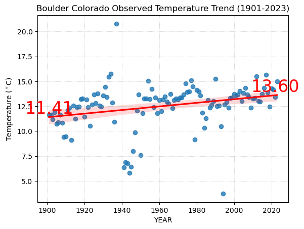

## gpb3037 - Earth Data Science Portfolio

Current Employment
  <ul>
    <li>Community Safety Official (CSO) for <a href="https://www.colorado.edu/police/" target="_blank">CUPD</a></li>
    <li>Field Representative (FR) for <a href="https://www.census.gov/programs-surveys/acs/" target="_blank">US Census ACS</a></li>
    <a href="https://www.linkedin.com/in/gpaulbailey/" target="_blank">LinkedIn</a>
  </ul>
​​​​​​​​​​​​​​​​

## Class Work
### First Map
### University of Colorado - Boulder (Main Campus)
#### This map shows the main campus of the University of Colorado (a.k.a. CU Boulder).  Established in 1876, the first building is <a href="https://www.colorado.edu/coloradan/2018/03/30/then-and-now-old-main">Old Main</a> $${\color{red}[red-triangle]}$$ located 40.009°N, -105.273°W, along the grassy quadrangle in the nortwestern portion of the campus outline.  Other of the <a href="https://www.colorado.edu/masterplan/history/cu-boulders-oldest-buildings">oldest buildings</a> on campus generally surround the <a href="https://www.historycolorado.org/location/norlin-quadrangle-historic-district">Norlin Quadrangle Historic District.</a>
#### The main campus subsequently developed towards the east and south bounded by streets now called Broadway (west), Baseline (south), 28th/US 36 (east), and Colorado/Folsom (northeast).  Additional housing was developed at <a href="https://www.colorado.edu/living/housing/williams-village-services-and-resources">Williams Village</a> in a separate area south east of the main campus, as well as the <a href="https://www.colorado.edu/map?id=336#!ct/83261,68796,68797,68838,68840,68841,68843,69772?s/?mc/40.01066710475513,-105.2466823399738?z/16?lvl/0?share">East Campus</a> which contains research centers, administrative, and facilities management functions.
Map data from Open Street Map and Esi Imagery
<embed type="text/html" src="posts/01-first-map/CGPTUniversity_of_colorado_map.html" width="600" height="600">

### Climate Data Analysis (INTERIM VERSION) - Boulder Colorado
#### This graph shows NOAA Global Historical Climatology Network daily climate data for Boulder Colorado obtained from the ESIIL Learning Portal for Station <a href="https://www.ncdc.noaa.gov/cdo-web/datasets/GHCND/stations/GHCND:USC00050848/detail">USC0005048</a>. That station has a precipitation and temperature data coverage of 97% with Start Date of 1893-10-01, and the extract from the learning portal includes data through 2023-09-30

##### There is discontinuity of data in the set for temperatures
* No temperature values until 1902
* No values from 07/01/1937 through 12/31/1940  
* 1994 is also missing a lot of data 
##### Temperature is converted from Fahrenheit in the dataset to Celsius in the graph.  The graph is interactive.
<embed type="text/html" src="posts/02-climate/BCOMEANTEMP2.html" width="600" height="600">
